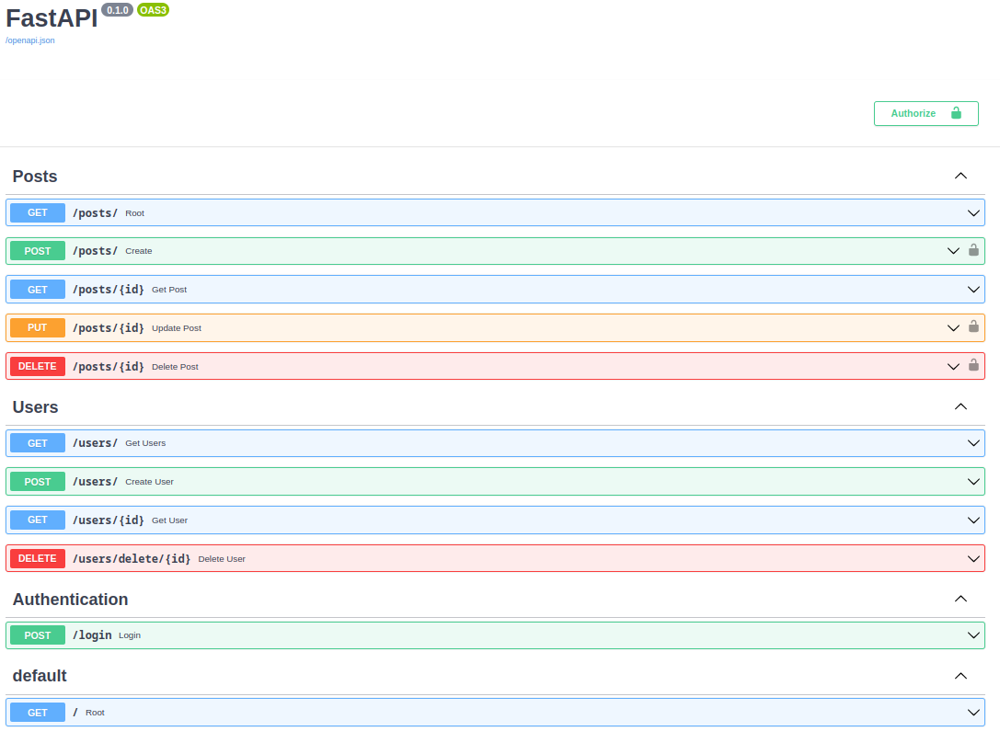
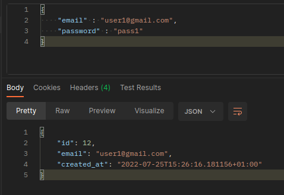
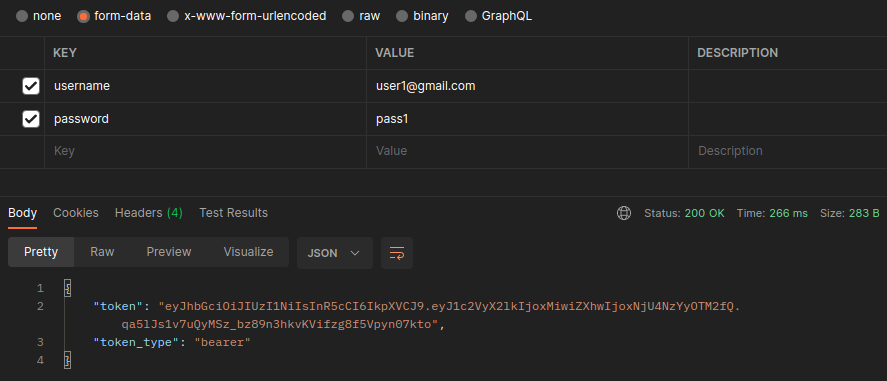
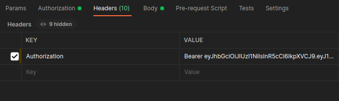

# Blog REST API
<p align = "center">
<a href="https://pypi.org/project/fastapi" target="_blank">
    
</a>
<a href="https://pypi.org/project/fastapi" target="_blank">
    
</a>
</p>

---

Blog REST API built using FastAPI with CRUD functionalities allows users to register, create, read, update, and read posts. All the blog posts are saved in a postgres database. The API requires authentication for delete and update operations.

**API Endpoints:**

<p align="center">
  
</p>

# Config

To connect to a postgres database, create a .env file in the root directory and add the following,

```
DATABASE_HOSTNAME=<HOSTNAME>
DATABASE_PORT=<PORT NUMBER>
DATABASE_PASSWORD=<PASSWORD>
DATABASE_NAME=<NAME>
DATABASE_USERNAME=<USERNAME>
```

To hash the user passwords, add the following to the .env file

```
SECRET_KEY=<KEY>
ALGORITHM=<HASING ALGORITHM>
ACCESS_TOKEN_EXPIRE_MINUTES=<EXPIRE MINUTES>
```

# Usage

To start the server, run the following command

```
uvicorn app.main:app

// during development

uvicorn app.main:app --reload
```
Create a new user:
<p align="left">
  
</p>

Login:

Login endpoint takes inputs as form-data. Copy the authentication token to create, edit, or delete a post.

<p align="left">
  
</p>

Create Post:

User the access token as Authentication header to create a post.
<p align="left">
  
</p>
